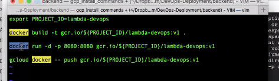
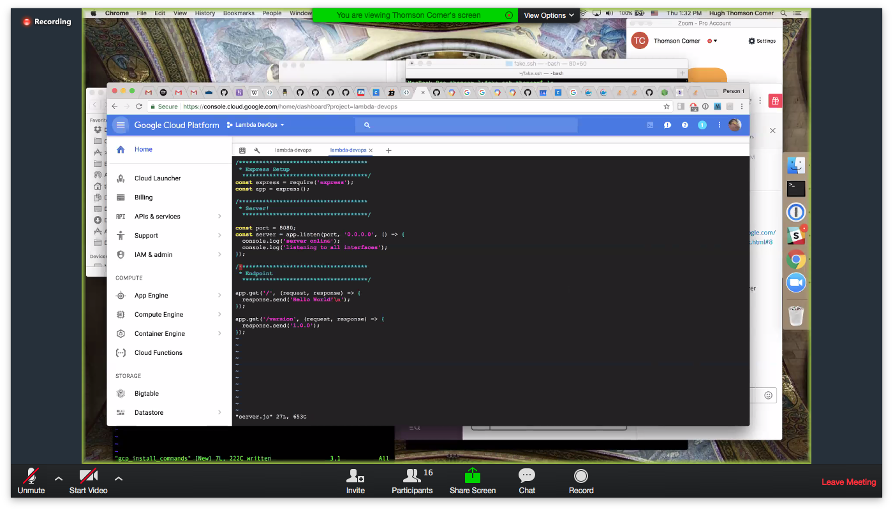
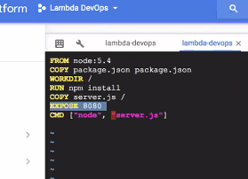

# Lambda University - September 14, 2017: Day 052, Thursday
## Coding Challenge #48
- "CSS Animations" available in https://repl.it/student/submissions/1571861
***
Ben Nelson
Thomson Comer
Ryan Hamblin
Ivan Mora
Sean Chen
Tai Chulikavit
Emily Sperry
Christine Gierer
GUEST LECTURER
NO_VIDEO_RECORDED
***
# [1st Lecture](VIDEO_RECORDED_NOT_POSTED) w/Emily Sperry: Review Code Challenge #48: CSS Animations
***
# [2nd Lecture](VIDEO_RECORDED_BUT_DEPRECATED_PER_FOLLOWING_VIDDY) w/Thomson Comer: Docker and LS-DevOps setup
- `env | grep PROJECT`
- https://codelabs.developers.google.com/codelabs/cloud-slack-bot/index.html#8

```console
docker run -d gcr.io/${PROJ
ECT_ID}/devops-deployment/backend:v1
```

***
#### LUNCH
# [3rd Lecture](https://youtu.be/_76fHf8HcuY) w/Thomson Comer: more Docker and LS-DevOps setup
```
FROM node:5.4
COPY package.json package.json
WORKDIR /
RUN npm install
COPY server.js /
EXPOSE 8080
CMD ["node", "/server.js"]
```

```console
export PROJECT_ID=lambda-devops

docker build -t gcr.io/${PROJECT_ID}/lambda-devops:v1 .

docker run -d -p 8080:8080 gcr.io/${PROJECT_ID}/lambda-devops:v1

gcloud docker -- push gcr.io/${PROJECT_ID}/lambda-devops:v1
```

- 1Password https://1password.com/





***
# [Brown Bag](VIDEO_RECORDED_NOT_POSTED) w/Austen Allred: Startups!
***
# [3rd Lecture](VIDEO_RECORDED_NOT_POSTED) w/Thomson Comer: LS DevOps / Deployment Q&A
- Kubernetes
```
If you see an issue with "Container Engine API is not enabled", you need to click into your Google Cloud project settings and go to Container Engine, then it will enable the API for you.

^^^ From the video, otherwise you can work through the tutorial directly.
```
***
# fin
