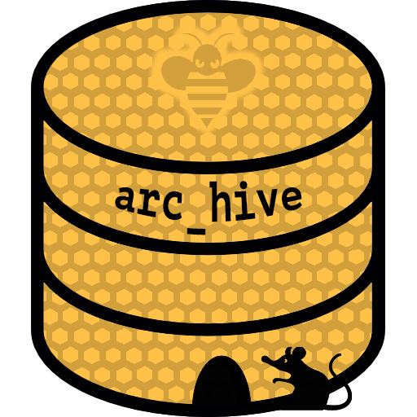
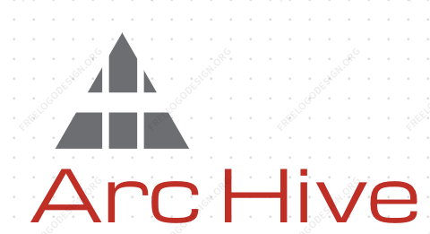

# Lambda School Streaming Content: Arc Hive
- Collected notes for cs1 Group Capstone Project: Lois, Tyge, Evan, Ryan & Patrick
- NOTE: click on the ▶︎ black ▶︎ triangles ▶︎ to expand a section

#### KickOff meeting
- https://docs.google.com/document/d/1sboqV94eDzEiKEs8Lh4W6DTSlwJMIczww0Kpv1__cU4/edit#
- https://youtu.be/NaCJiR7pi4E

#### Lecture organizer/viewer idea:

Rough Sketch Ideas From Kickoff Meeting

- House/organize daily schedule/videos (replace spreadsheets, Piazza)
- Can sort lectures by topics, upvote, basically similar functionality to Piazza but more friendly (and more video-focused)
- Slackbot to expose/share, make it more efficient to find recent videos
  - Use Slackbot to send videos to the app?
  - Automate other tasks w/Slack
  - Still probably have separate webapp, but heavy Slack integration possibly
- Feature: reminder to upload video, *maybe* even upload automatically (could be extended to another project idea itself)
- Challenge: app would have to accommodate delay in video upload/processing
- Challenge: permissions, auth, acl, etc.

#### Weekly presentations to cs1
- https://docs.google.com/document/d/1biRjYRykSJU09Gel4Fd4TqAkyadMNcMZcnVcGJ5lAW8/edit
- [First Week CS1 Demos](https://youtu.be/0FH5zC0tg-Q)
- [Second Week CS1 Demos](https://youtu.be/eWjym0ahi-4)

# Minimum Viable Product
- a teacher pastes a youtube link into Slack with a slash command `arc` or `/arc https://youtu.be/ZihgMcrHOF4`
- a student retrieves chronological list of youtube vids `/hive`
- post content with timestamp, instructor, lecture title, cohort & url

### Additional targets:
 - @channel notifications
 - prevent non-YouTube links/posts
 - Only instructors ans TA's may post content, Students constrained to retrieval
 - tests
 - documentation (incl. code comments)

# Project Management
### User Flow Chart
- https://www.lucidchart.com/invitations/accept/df9009eb-6ffb-467e-9327-38077ed0331a

### Trello
- https://trello.com/b/VJ9rXVN4/cms-slackbot

### Tyge's Meeting Notes
- https://docs.google.com/document/d/1XIZVj97Kjwc3g1ib7fZh6Zbnx0fi9ZDjBy6BlFJOHT0/edit

# API's
### Slack
- https://api.slack.com/bot-users
- https://api.slack.com/slack-apps
- https://api.slack.com/tutorials
- https://api.slack.com/slash-commands
- https://blog.takipi.com/7-essential-slack-integrations-developers-should-know/
- https://blog.takipi.com/how-we-used-slack-scala-and-play-to-automate-our-lunch-order/
- https://medium.com/slack-developer-blog/build-a-serverless-slack-bot-in-9-minutes-with-node-js-and-stdlib-b993cfa15358
- https://join.slack.com/t/testspaceforbots/shared_invite/enQtMjgwODM5ODMwOTAyLWZlZGI4YmY0NjBmYmFhYzI2NWMyNTg0ZmM1NDhiOTAyZDdlNzE1MzViMWEyNzJjN2FiNWYzMGE2M2Q1N2E2ZTM

### Airtable
- Introduction: https://airtable.com/appaWw6cCsdq5snMh/api/docs#curl/introduction
- Invite from Evan: https://airtable.com/invite/l?inviteId=invbyUaq8FEA2OAcE&inviteToken=a7034c2596791de502f55f96f39b7c4f
- Guide: https://guide.airtable.com/
- https://github.com/airtable/airtable.js

### Authentication Middleware
- https://developer.okta.com/blog/2017/09/14/lazy-developers-guide-to-auth-with-vue

### Zapier
- https://zapier.com/apps/integrations
- https://support.zoom.us/hc/en-us/articles/205260649-How-To-Use-Zapier

### YouTube
- https://developers.google.com/youtube/v3/
- https://github.com/tokland/youtube-upload/blob/master/setup.py

# NOTES
### Aaron's set-up notes from Slack
- https://lambdaschoolstudents.slack.com/archives/G5TDU61DE/p1511816408000751

Project and Group Set-up

> Please chat amongst your group, form a private slack channel (wacky team names encouraged), and invite your lecturer. Once that's all set, you'll work with them to continue getting repos/boilerplate set up.

> Immediate goals: grouped with Slack channel and GitHub org, basic boilerplate repo (with initial tech decisions) created. Tomorrow you'll start getting Agile, set up Trello, do issue estimation/prioritization/assignment. From Wednesday on - code!

> We want groups to work independently, so you get a feel for the "real world" of software engineering - we will of course be available, and if you're blocked don't hesitate to reach out, but don't feel like you need our sign off for everything either. See us as stakeholders who want to see your project delivered (and help you make high level decisions), but not fulltime micromanagers who need to know every detail along the way.

> Your group should self-organize and coordinate a schedule that works for you, and invite us (the lecturers) to your meetings - we won't attend every one, but should make it to Monday (sprint planning) and Friday (demo/review). Tues-Thurs you should have standups in the morning, which lecturers may or may not attend as time allows. We'll go over more details about this process tomorrow.

> Also, as we get going with a full git workflow (branching, merging pull requests) we want to encourage you to involve TAs as code reviewers. They probably know more about React Native and such than I do at least, and can help you make good decisions as you work day to day. Again, more details tomorrow, but wanted to give you all a high level picture now so you know what to expect.

> If you have any concerns about any of the above - group assignments, schedule, process, etc. - please DM me as soon as possible.

> One other good initial task (once you have a slack channel) - copy the section of the kickoff doc corresponding to your project, make a new doc, and elaborate on it together. Keep brainstorming, but also start taking a more critical/realistic eye to narrow scope and really define what it is you want to achieve over the next ~4-6 weeks.

### Aaron's `git branch` notes from Slack:
- https://lambdaschoolstudents.slack.com/archives/C8771SARM/p1511912639000132

git branching

> I'll give a few-sentence version of my git branching approach - caveat is that their are a ton of these, none is definitively right or wrong, use whatever is right for your team/context and that you all agree on. Same for most process stuff, as you've learned.

> Basically, master branch is the main branch - code is delivered by merging into master.

> But you shouldn't directly commit to master - the exception would be "emergency" bugfix commits that need to be deployed right away (since master is the code you deploy).

> Forks is a GitHub thing and not a git thing - lets you make your own complete copy of a repo. A branch on the other hand is just like another path in the repo - git repos can be envisioned as trees, actually, if you want to flash back to data structures.

> So a branch really is a branch in that sense, while a fork is your own custom tree.

> For the purposes of this project I'd encourage your work to be in branches in the org repo, not forks of the repo - that's how most real work happens, since the company e.g. pays for a GitHub org that can have private repos.

> Anyway, aside from emergency commits you should work in a branch, and in general you should have one branch for each feature/issue/card you're working on. You should also only be working on a few things at a time, so there shouldn't be *that* many active branches.

> The team should agree on a branch naming convention - one that I'm partial to is: `type/user_short_description`

> Type is usually one of feature or bugfix, or maybe documentation. User is your GitHub username. Short description is a *short* (1-3 words) summary of what it is.

> And you're cloning the actual org repo. (edited)

> So an example branch name may be `feature/soycode_add_widgets`

> Yeah it'll make sense pretty quickly - also I do all git interaction command line, so I'll be giving those commands here, but specific IDE integration may vary.

> The basic workflow though is:

1. Clone the org repo
2. `git checkout -b type/user_short_description` to make the branch (this also switches you to it)
3. Work as normally - edit files, make commits.
4. `git push` should work as normal, on your first push you may have to set the upstream e.g. `git push --set-upstream origin type/user_short_description`

> That's what you do to get the code and add your own branch with your commits, and then push it back to GitHub. To actually merge your branch into master when it's done, you can make a pull request on GitHub similar to across forked repos.

> The pull request shows the diff and lets people review the code, leave comments, etc. - this is also important, and we'll talk more about it in coming weeks. For now all you need to know is keep an eye out for pull requests, and ask TAs to help code review.

> I can demo this later too if that would help.

> Does all this make sense so far? Emoticon or questions or such welcome.

> Also `git checkout branchname` is how you just switch between existing branches without making new ones - the `-b` flag is the special case of making it for the first time.

> You can check out branches from other people too, that way you can run their code locally to review it.

- git branching procedure cheatsheet?
- git branch merging cheatsheet?

# Wishful Thinking
1. Automated Zoom video uploading to YouTube.
  - Posting resulting YouTube link in Slack (Piazza or whatever LS is moving fwd with).
  - Possible Zoom cloud options, or from direct from Instructors' desktop mp4 files once the video/audio file is done being written (if desktop recording, likely limited to macOS and Linux development?)
  - Also, possible full automation of uploading Zoom video to YouTube AND posting of link to Slack AND ingesting link into Content management system database for retrieval by students.
  - https://zapier.com/apps/youtube/integrations/zoom
  - https://developer.zoom.us/docs/api/
  - https://zoom.github.io/api/#cloud-recording
  - YouTube API
  - https://developers.google.com/youtube/v3/getting-started
  - https://developers.google.com/youtube/v3/
  - https://github.com/tokland/youtube-upload/blob/master/setup.py
 
2. Expanded content management to include extensive tags per lecture content
  - e.g. React, Redux, React-Native, ES6, MongoDB, etc.
  - timecode links to lecture video sections.

3. Custom/Propritary Lambda School video/audio file hosting for all lectures, brownbags and in-house generated streaming content.
  - https://ourcodeworld.com/articles/read/496/how-to-create-a-videochat-with-webrtc-using-peerjs-and-node-js
  - http://doc-kurento.readthedocs.io/en/latest/what_is_kurento.html

# Logo Ideas:

***

